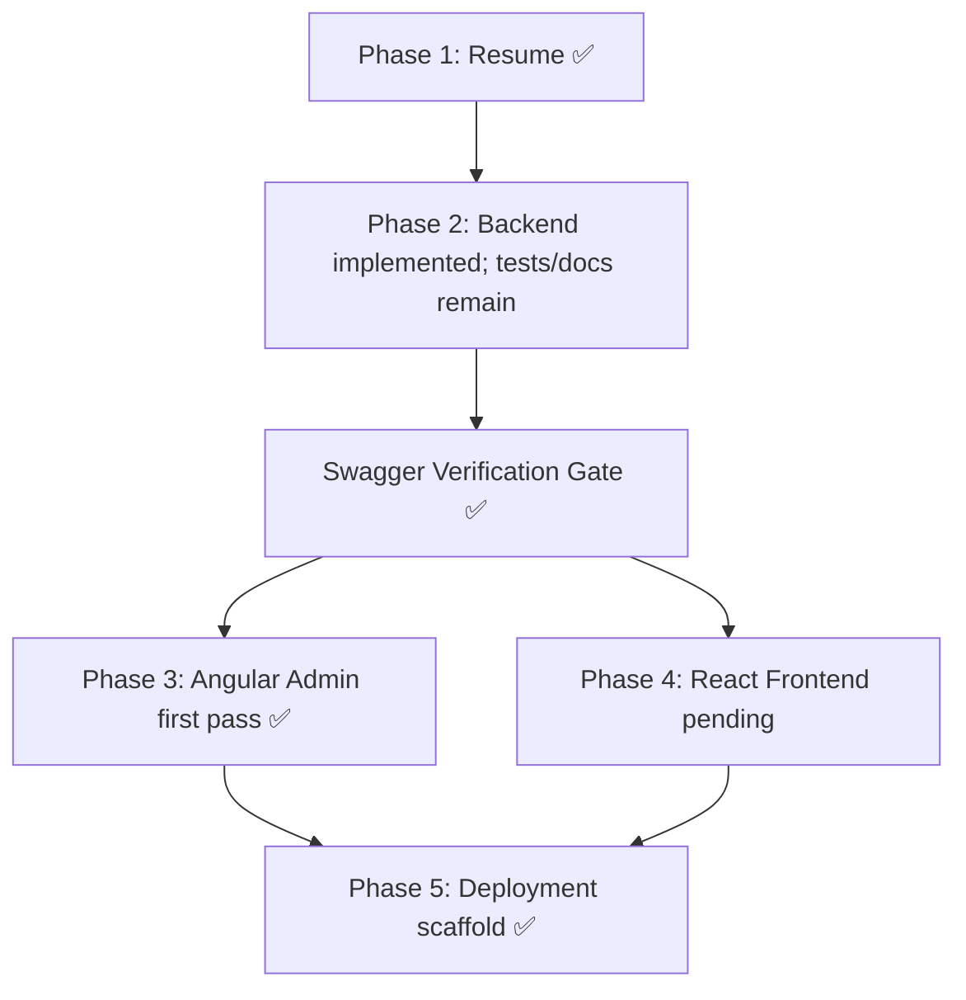

# Portfolio System — Full Implementation Plan

## Phase 1 Status: Resume Read ✅ (Needs Verification)

### What was extracted from [FlowCV resume](https://flowcv.com/resume/26jhkw4o1t):

| Field                                            | Status                             |
| ------------------------------------------------ | ---------------------------------- |
| Name: **ELhachmi Salah**                         | ✅                                 |
| Title: **Senior Android Developer**              | ✅                                 |
| Email: essalah.elhechmi@gmail.com                | ✅                                 |
| Phone: +216 27 441 054                           | ✅                                 |
| LinkedIn                                         | ✅                                 |
| Summary (11 yrs experience)                      | ✅                                 |
| 27 Skills across 8 categories                    | ✅                                 |
| 3 Work experiences (Digitus, Tayara, ConceptLab) | ⚠️ Missing dates/locations         |
| 2 Education entries                              | ⚠️ Missing institution names/dates |
| Languages                                        | ⚠️ Assumed — needs confirmation    |
| Projects, Certifications                         | ⚠️ None found                      |
| GitHub URL, Avatar                               | ❌ Missing                         |

Output saved to: [resume_data.json](file:///home/elhachmi/workspace/perso/portfolio/data/resume_data.json)

> [!CAUTION]
> **The FlowCV page is JavaScript-rendered and couldn't be fully parsed.** The `resume_data.json` has gaps marked in its `_meta.notes` field. Please review and fill in:
>
> 1. Exact employment dates for all 3 positions
> 2. Education institution names and dates
> 3. Work locations
> 4. GitHub URL
> 5. Languages & proficiency levels
> 6. Any projects or certifications not captured

---

## Open Questions

> [!IMPORTANT]
>
> 1. **Please verify/complete `resume_data.json`** — especially dates, institutions, and GitHub URL
> 2. **JWT vs OAuth2?** Recommendation: JWT (simpler for single-admin portfolio)
> 3. **Storage**: Start Cloudinary-only, or build S3 abstraction immediately?
> 4. **Single admin or multi-admin?**
> 5. **Angular Material 3 or 2?**
> 6. **Deployment target**: Railway / Render / AWS / VPS?

---

## Project Structure

```
portfolio/
├── data/resume_data.json          # Phase 1 output
├── backend/                        # Spring Boot 3.x, Java 21+
│   └── src/main/java/com/portfolio/
│       ├── config/                 # Security, CORS, OpenAPI
│       ├── entity/                 # JPA entities
│       ├── repository/             # Spring Data JPA
│       ├── dto/                    # Request/Response DTOs (@Valid)
│       ├── mapper/                 # Entity ↔ DTO
│       ├── service/                # Business logic
│       ├── controller/pub/         # /api/v1/portfolio/** (PermitAll)
│       ├── controller/admin/       # /api/v1/admin/** (ROLE_ADMIN)
│       ├── security/               # JWT filter, auth
│       └── storage/                # Cloudinary/S3 abstraction
├── admin/                          # Angular (standalone, Signals)
├── frontend/                       # React Router v7 (Framework Mode)
├── docker/                         # Dockerfiles + compose
└── .github/workflows/              # CI/CD
```

---

## Phase 2 — Spring Boot Backend

## Phase 2 Status: Backend Implemented, Hardening Remaining ✅

- Core backend components are implemented: entities, repositories, DTOs, mappers, services, controllers, JWT security, Cloudinary upload, structured API errors, validation hardening, and SpringDoc/OpenAPI metadata.
- Swagger UI has been verified at `/swagger-ui.html` and the OpenAPI document is available at `/api-docs`.
- An Angular admin dashboard first pass has been created in `admin/` with login, auth guard, JWT interceptor, protected shell, overview, and reusable CRUD manager.
- Docker/Compose, environment template, CI workflow, and deployment notes are now present for backend/admin/PostgreSQL.
- Current work focuses on testing admin CRUD flows against the running backend, adding image upload UI, expanding API documentation coverage, and beginning the public React frontend.

**Execution order**: Entities → Migrations → Repos → DTOs → Mappers → Services → Controllers → Security → OpenAPI → Seed data → Admin scaffold

### Task 2.1 — JPA Entities (FIRST)

Entities in `com.portfolio.entity`:

- `Profile` — name, title, summary, email, phone, location, website, avatar_url
- `SocialLink` — platform (enum), url → `@ManyToOne` Profile
- `Experience` — company, role, start/end dates, location, description, sort_order → `@OneToMany` Achievement
- `Achievement` — description → `@ManyToOne` Experience
- `Project` — title, description, image_url, live_url, github_url, featured, sort_order → `@ManyToMany` Skill
- `Skill` — name, category (enum), proficiency (enum), sort_order
- `Education` — institution, degree, field, dates, sort_order
- `Certification` — name, issuer, date, url, sort_order
- `Language` — name, proficiency
- `AdminUser` — username, password_hash, role

Enums: `SkillCategory`, `SkillProficiency`, `SocialPlatform`

### Task 2.2 — Flyway Migrations

- `V1__initial_schema.sql` — All tables with constraints & indexes
- `V2__seed_data.sql` — Insert from `resume_data.json` + default admin user

### Task 2.3 — Security (Strict Boundaries)

| Path Pattern                       | Access                         |
| ---------------------------------- | ------------------------------ |
| `/api/v1/portfolio/**`             | `permitAll` (public)           |
| `/api/v1/admin/auth/login`         | `permitAll` (login endpoint)   |
| `/api/v1/admin/**`                 | `hasRole('ADMIN')` + valid JWT |
| `/swagger-ui.html`, `/api-docs/**` | `permitAll` (dev only)         |

Components: `JwtTokenProvider`, `JwtAuthenticationFilter`, `SecurityConfig`, `BCryptPasswordEncoder`

### Task 2.4 — API Endpoints

**Public** (`/api/v1/portfolio/`): GET profile, experiences, projects, projects/featured, skills, education, certifications, languages

**Admin** (`/api/v1/admin/`): POST login; full CRUD for all entities; POST image upload

### Task 2.5 — OpenAPI/Swagger

- SpringDoc with API grouping (public vs admin)
- `@Operation` + `@ApiResponse` annotations on all endpoints

> [!NOTE]
> **PHASE GATE PASSED**: Swagger UI has been verified at `/swagger-ui.html`, and `/api-docs` returns OpenAPI JSON.

### Phase 2 Completed

- JPA entities, repositories, DTOs, mappers, services, and controllers are present.
- Flyway migrations and seed data are present.
- JWT login and admin route protection are implemented.
- Public portfolio endpoints are implemented.
- Admin CRUD endpoints are implemented for the core entities.
- Cloudinary-backed storage upload service and admin upload endpoint are implemented.
- Structured `ApiError` responses and field-level validation details are implemented.
- Request DTOs use stronger enum typing and URL validation limits.
- Backend compile verification passes with `mvn compile`.

### Phase 2 Still Pending

- Add focused integration tests for auth, validation errors, public access, admin access, and storage failure behavior.
- Continue adding detailed SpringDoc annotations, response examples, and operation metadata across all controllers.
- Re-run Swagger verification after each API shape change.

---

## Phase 3 — Angular Admin Dashboard (Signals Only)

> [!IMPORTANT]
> **ALL components use Angular Signals.** No `BehaviorSubject`, no `ngrx`, no Zone.js patterns.
>
> - `signal()` for state, `computed()` for derived, `effect()` for side effects
> - `resource()` / `rxResource()` for async data (Angular 19+)

### Features

- **Login** — JWT auth, `HttpInterceptorFn` for token attachment
- **Dashboard** — Stats via computed signals
- **CRUD Editors** — Profile, Experience, Projects, Skills, Education, Certifications, Languages
- **Image Upload** — Drag & drop with `previewUrl = signal<string | null>(null)`
- **Auth Guard** — `CanActivateFn` using signals
- Standalone components, Angular Material 3 + Tailwind

### Phase 3 Completed

- Angular standalone app builds successfully.
- `/login` is implemented and wired to `/api/v1/admin/auth/login`.
- Auth state is signal-backed and persisted in `localStorage`.
- Functional JWT interceptor and route guard are implemented.
- Protected dashboard shell and overview are implemented.
- Reusable CRUD manager routes are implemented for the admin entities.
- No `BehaviorSubject` usage exists in `admin/src` or backend code.

### Phase 3 Still Pending

- Test all CRUD routes against a running backend.
- Replace generic editors for nested/relationship fields with richer controls.
- Add image upload controls and previews to relevant admin forms.
- Improve empty/loading/error states after live backend testing.

---

## Phase 4 — React Router v7 Public Frontend (Loaders Only)

> [!IMPORTANT]
> **ALL routes use `loader` functions.** No `useEffect` data fetching. This ensures SSR, SEO, zero CLS.

### Routes with Loaders

| Route             | Loader                               | Meta                  |
| ----------------- | ------------------------------------ | --------------------- |
| `/`               | Profile + featured projects + skills | "{Name} — Portfolio"  |
| `/about`          | Profile + languages + education      | "{Name} — About"      |
| `/experience`     | All experiences + achievements       | "{Name} — Experience" |
| `/projects`       | All projects                         | "{Name} — Projects"   |
| `/projects/:slug` | Single project                       | "{Project Title}"     |
| `/contact`        | Profile contact info                 | "{Name} — Contact"    |

### UI/UX

- Dark mode primary + light toggle
- Framer Motion (reveal-on-scroll, page transitions, hover micro-interactions)
- Bento Box layouts, smooth timeline, mobile-first
- Tailwind CSS, Inter/Outfit fonts

### Phase 4 Status

- Pending. Backend and admin contracts are now stable enough to start a first React Router v7 implementation pass.

---

## Phase 5 — Production & Deployment

- DTO validation (`@Valid`, `@NotBlank`, `@Size`, etc.)
- Dockerfiles (multi-stage) for backend, admin, frontend
- `docker-compose.yml` with PostgreSQL
- `.env.example` for all secrets
- GitHub Actions CI/CD

### Phase 5 Completed

- `backend/Dockerfile`
- `admin/Dockerfile`
- `admin/docker/nginx.conf`
- `docker/compose.yml`
- `.env.example`
- `.github/workflows/ci.yml`
- `docs/plans/deployment.md`

### Phase 5 Still Pending

- Add frontend Dockerfile after the public React app exists.
- Run full `docker compose up` validation with real environment values.
- Extend deployment automation once the target host/provider is chosen.

---

## Verification Plan

| Phase | Verification                                                                                                                                                                        |
| ----- | ----------------------------------------------------------------------------------------------------------------------------------------------------------------------------------- |
| 1     | `resume_data.json` valid, all sections present                                                                                                                                      |
| 2     | `mvn compile` ✅, Flyway runs ✅, Swagger UI available at `/swagger-ui.html` ✅, OpenAPI JSON available at `/api-docs` ✅, public endpoints open ✅, admin endpoints require JWT ✅ |
| 3     | `npm run build --prefix admin` ✅, no `BehaviorSubject` in codebase ✅, live login/CRUD verification pending                                                                        |
| 4     | Public React app pending: `npm run dev`, loader checks, SSR HTML, and Lighthouse still pending                                                                                      |
| 5     | `docker compose -f docker/compose.yml config` ✅, full `docker compose up`, end-to-end runtime, and CI execution still pending                                                      |

## Dependency Graph



> [!NOTE]
> Phase 4 can begin next. Phase 3 should continue with live CRUD verification and richer admin forms.
